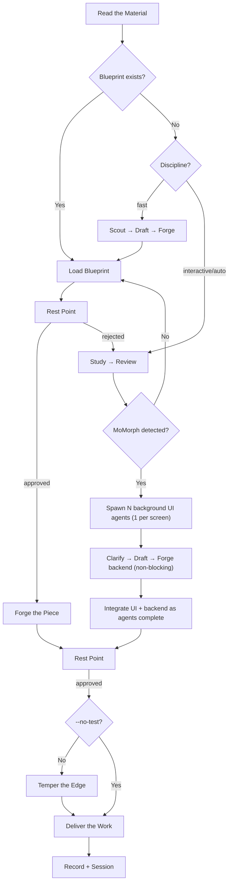

# Takumi (匠) — The Craftsman's Implementation

The master craftsman does not measure success by speed.
Every piece that leaves the workshop is examined, tested, and refined.
No feature ships without a blueprint. No blueprint earns approval without review.

**Principles:** YAGNI, KISS, DRY | Token efficiency | Concise stage reports

## Usage

```
/tkm:takumi <natural language task OR plan path>
```

If no discipline is specified, the craftsman defaults to **interactive** — full control, full craft.

**Working disciplines:**
- `--interactive`: Full pipeline with rest points for your review (**default**)
- `--fast`: Scout the material, draft, forge — no deep research
- `--parallel`: Many hands, many pieces — multi-agent execution
- `--no-test`: Forge without tempering — use only when conditions warrant
- `--auto`: Continuous craft — the master trusts his own hands

**Examples:**
```
/tkm:takumi "Add user authentication to the app" --fast
/tkm:takumi path/to/plan.md --auto
```

## Workshop Law

A craftsman measures twice, cuts once.
No chisel touches wood before its blueprint is drawn.
No blueprint earns its seal before passing through the master's review.

This is not procedure imposed from outside — it is the discipline that separates craft from labor.
The only exception: when the one who commissioned the work explicitly grants it.

*Note:* `--fast` discipline skips deep research, but the blueprint step remains sacred.
User override: if the user explicitly says "just code it" or "skip planning", honor their instruction.

## The Craftsman's Creed

*"Simple pieces hide the hardest grain."*
— Every task that feels trivial conceals unexamined assumptions. The blueprint costs thirty seconds. Rework costs hours.

*"Knowing the way is not walking it clean."*
— Confidence in the solution does not replace committing it to paper. Write it down.

*"The fastest path runs through the blueprint."*
— Draft → forge → deliver beats forge → break → restart, every time.

*"Speed is earned through discipline, not shortcuts."*
— A master works fast because they have walked every step before. A novice rushes and circles back.

*"Once" is how every exception begins.*
— There are no isolated skips. The standard holds or it does not.

## Reading the Material

The craftsman reads intent from what is brought to the workshop:

| Presented Material | Detected Discipline | Working Pattern |
|-------------------|--------------------|-----------------|
| Path to `plan.md` or `phase-*.md` | code | Execute the existing blueprint |
| Contains "fast", "quick" | fast | Scout → draft → forge |
| Contains "trust me", "auto" | auto | Continuous, no rest points |
| 3+ distinct features OR "parallel" | parallel | Multi-agent execution |
| Contains "no test", "skip test" | no-test | Skip tempering step |
| (default) | interactive | Full pipeline with rest points |

See `references/intent-detection.md` for the detection logic.

## Seven Stages (Authoritative Flow)



**This diagram is the authoritative workflow.** If prose conflicts with this flow, follow the diagram.

## Stage Overview

```
[Read Material] → [Study?] → [Review] → [Blueprint] → [Review] → [Forge] → [Review] → [Temper?] → [Review] → [Deliver]
```

**Interactive (default):** Pauses at each rest point for your approval before advancing.
**Auto discipline:** Advances through all stages without pause — the master trusts the process.
**Claude Tasks:** Use `TaskCreate`, `TaskUpdate`, `TaskGet`, `TaskList` during the forge stage. **Fallback:** CLI-only tools, unavailable in VSCode extension. If they error, use `TodoWrite` instead.

| Discipline | Study | Tempering | Rest Points | Progression |
|------------|-------|-----------|-------------|-------------|
| interactive | ✓ | ✓ | **Approval at each stage** | One stage at a time |
| auto | ✓ | ✓ | Auto if score≥9.5 | All stages, no pauses |
| fast | ✗ | ✓ | **Approval at each stage** | One stage at a time |
| parallel | Optional | ✓ | **Approval at each stage** | Concurrent groups |
| no-test | ✓ | ✗ | **Approval at each stage** | One stage at a time |
| code | ✗ | ✓ | **Approval at each stage** | Per blueprint |

## Stage Output Format

```
⚒ Stage [N]: [Brief status] — [Key metrics]
```

## Workshop Rest Points (Non-Auto Disciplines)

The craftsman pauses here for your eye before advancing (skipped with `--auto`):
- **After Study:** Review findings before drafting the blueprint
- **After Blueprint:** Approve the plan before the forge begins
- **After Forge:** Inspect the work before tempering
- **After Tempering:** 100% pass + approval before delivery

**Always enforced across all disciplines:**
- **Tempering:** 100% pass required (unless no-test discipline)
- **Master's Inspection:** Approval OR auto-approve (score≥9.5, 0 critical)
- **Delivery (MANDATORY — never skip, never reorder):**
  The commit question is not the seal of the work — the Delivery Manifest is. Steps 1–3 run BEFORE the commit prompt, always.
  1. `project-manager` subagent → sync all completed stages back to `phase-XX-*.md` and `plan.md`
  2. `doc-writer` subagent → review `./docs` AND (when present) `docs/specs/` for impact. **ALWAYS spawn this subagent.** "No update needed" is `doc-writer`'s verdict to return, not Takumi's verdict to assume. Detection + impact map built in `workflow-steps.md` Stage 6.
  3. `TaskUpdate` → mark Claude Tasks complete after sync-back
  4. **Emit the Delivery Manifest (below)**, then ask if the work should be committed via `git-manager`
  5. Run `/tkm:write-journal` to record the session

  **Delivery Manifest — emit verbatim to the user before the commit prompt:**
  ```
  ⚒ Delivery Manifest
  - [x] project-manager — plan.md & phases reconciled
  - [x] doc-writer — docs/ and docs/specs/ reviewed (verdict: <updated N files | no changes needed>)
  - [x] TaskUpdate — all tasks closed (or N/A in VSCode)
  - [ ] git-manager — awaiting your seal
  - [ ] /tkm:write-journal — pending
  ```
  - Boxes 1–3 must read `[x]` before any commit prompt. If any is `[ ]`, complete that subagent NOW.
  - A Manifest that was not printed to the user did not happen. Silent self-checks do not pass this gate.

## Delivery Anti-Rationalization (Stage 6 Specific)

The forge is hot. The inspection passed. The temptation is to seal the work with one final question. Resist — that is where the discipline most often fails.

| The Whisper | The Master's Answer |
|-------------|---------------------|
| "Tests pass, review approved — just commit." | The commit is not the seal. The Manifest is. The Manifest comes first. |
| "This change touches no docs — skip `doc-writer`." | You are not the docs authority. `doc-writer` is. Spawn it. It returns its verdict in seconds. |
| "The plan is already in sync — skip `project-manager`." | Stale checkboxes from earlier stages are the most common drift. Spawn it. |
| "The user said 'commit' — they want the commit." | A commit instruction is not a license to skip Delivery. Deliver first, then commit. |
| "I'll record the docs/journal in a follow-up session." | There is no follow-up session for this piece. It is sealed now or it is not sealed. |

## Workshop Delegation (Mandatory Subagents)

| Stage | Subagent | Requirement |
|-------|----------|-------------|
| Study | `researcher` | Optional in fast/code |
| Scout | `tkm:scan-codebase` | Optional in code |
| Blueprint | `planner` | Optional in code |
| UI Craft | `ui-ux-designer` | If frontend work |
| **MoMorph UI** | **`implementer` (background, 1 per screen)** | **If MoMorph detected — spawn N agents for N screens BEFORE drafting** |
| Tempering | `tester`, `debugger` | **MUST** spawn |
| Inspection | `reviewer` | **MUST** spawn |
| Delivery | `project-manager`, `doc-writer`, `git-manager` | **MUST** spawn all 3 |

**Critical enforcement:**
- Stages 4, 5, 6 **MUST** use Task tool to spawn subagents
- DO NOT perform tempering, inspection, or delivery yourself — delegate
- If workflow ends with 0 Task tool calls, the work is INCOMPLETE
- Pattern: `Task(subagent_type="[type]", prompt="[task]", description="[brief]")`

## References

- `references/intent-detection.md` — Material reading rules and discipline routing
- `references/workflow-steps.md` — Detailed stage definitions for all disciplines
- `references/review-cycle.md` — Interactive and auto inspection processes
- `references/subagent-patterns.md` — Workshop delegation patterns
- Canonical docs mapping: `claude/skills/_shared/docs-canonical-mapping.md` — surgical-edit rule, escalation heuristic, version policy
